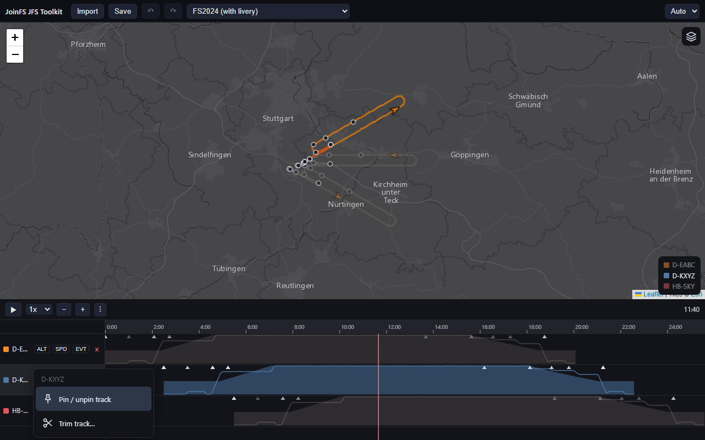
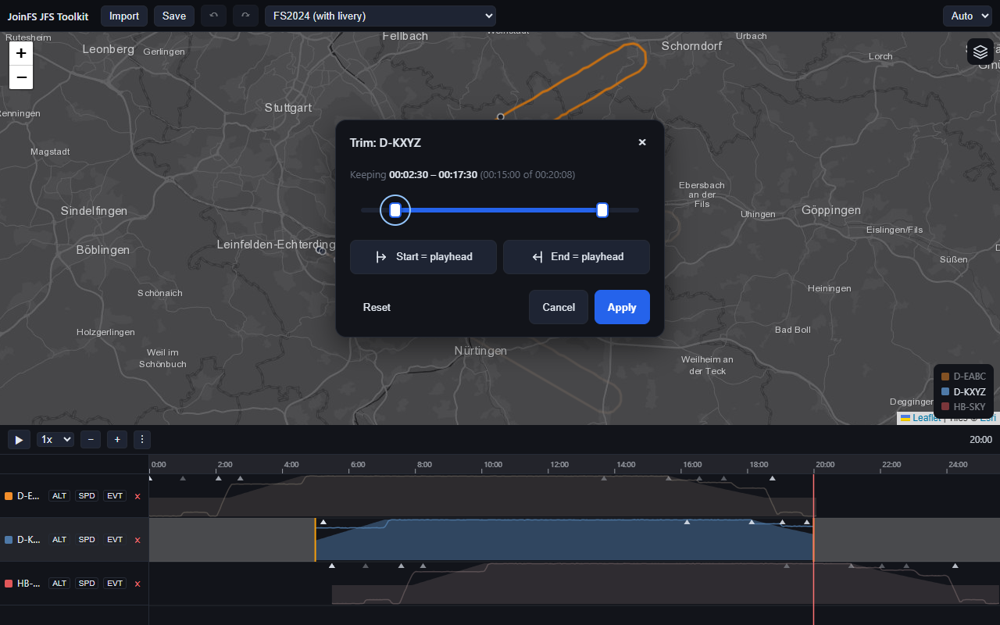

# Editing Tracks

Nothing you do changes your original files. Edits live in the open page and reach a file only when you save.

## Undo and redo

Every change is a command in a history: **Ctrl+Z** undoes, **Ctrl+Shift+Z** (or Ctrl+Y) redoes, and the two arrow
buttons in the toolbar do the same. Moving, removing, pinning and trimming are all covered.

## Move a track in time

Drag a row on the timeline sideways. The track keeps its frames; only its offset changes, so you can line up
recordings made at different moments. Release to apply; undo restores the old position.

A pinned track (below) cannot be dragged.

## The 00:00 rule

The timeline's **00:00** is where the saved file starts. If you move a track so that part of it lies before 00:00:

- the map and the timeline show that part as cut (the track simply starts at the left edge),
- on **Save** those frames are removed; the last gear, flaps, lights and name values from before the cut are written
  again at 00:00, so the replay starts in the right state,
- other tracks keep their exact timeline positions (a track that starts later keeps its lead-in),
- a track that lies completely before 00:00 is not saved.

Nothing is stored for this: move the track back to the right and the whole track is back.

## Remove a track

The × in the track's row removes it from the project after a confirmation. **Ctrl+Z** brings it back.

## Track actions

The functions that work on one track are plugins and are reached in two ways:

- **right-click** the track's row (the name column or the chart); the track is selected and a menu opens,
- the **⋮** button at the right of the **+/−** buttons in the timeline header; it works on the selected track, or on
  the only track when just one is loaded.

Menu entries have icons and come from the [plugins](Plugin-Concept). The menu closes with **Esc** or a click outside.

### Pin / unpin track

Locks a track in time. A pinned track shows a pin on its row and cannot be dragged. Use it to protect a reference
track while you line up the others. Undoable. A pin is a working aid only; it is not saved in the recording.

### Trim track

Cuts the start and the end off a track **without changing it**, until you save.

1. Right-click the track and choose **Trim track…**. A dialog opens over the map; the timeline and the playhead stay
   usable.
2. Set the part to keep:
   - drag the two handles on the range bar (click the bar to move the nearer handle; with a handle focused the
     arrow keys move it by 1 s, Shift by 10 s),
   - or move the playhead to the wanted spot and press **Start = playhead** or **End = playhead**,
   - **Reset** brings back the whole track.
3. The line above the bar shows what is kept and how much of the whole, for example *Keeping 00:00:03.7 –
   00:00:10.9 (00:00:07.2 of 00:00:14.8)*.
4. **Apply** stores the trim (one undoable step). **Cancel**, the **×** or **Esc** closes the dialog and keeps
   whatever was applied before.

While the dialog is open, and after Apply, the timeline and the map show the track **as it will be saved**: only
the kept part is drawn and the arrow is hidden outside it. While you are still adjusting, the cut parts are hinted in
grey with amber borders.

On Save, the cut parts are removed and the state of gear, flaps, lights and names from before the new start is
written again at the start, so the replay begins correctly. Simulator events before the start are dropped. The
trim follows the track when you move it. Trimmed recordings start at 00:00 in the saved file.

## Not editable (yet)

Adding, deleting or moving single gear, flaps or light events is planned as a further plugin. See
[Plugin Concept](Plugin-Concept#roadmap).
