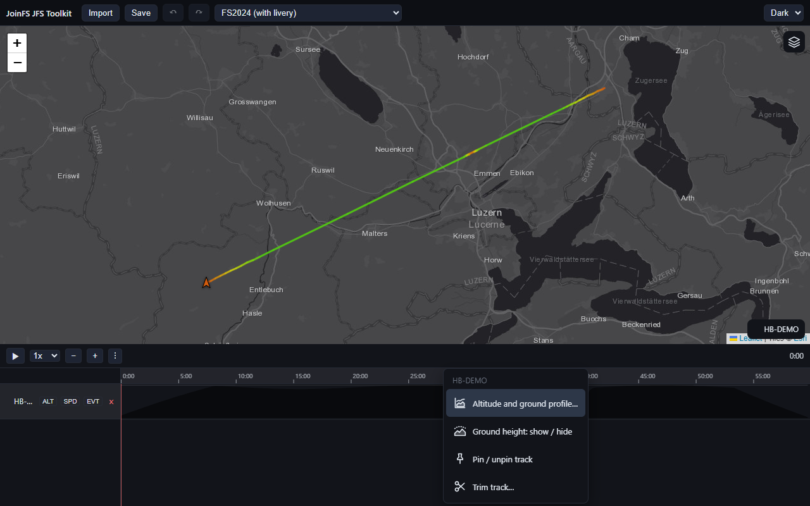
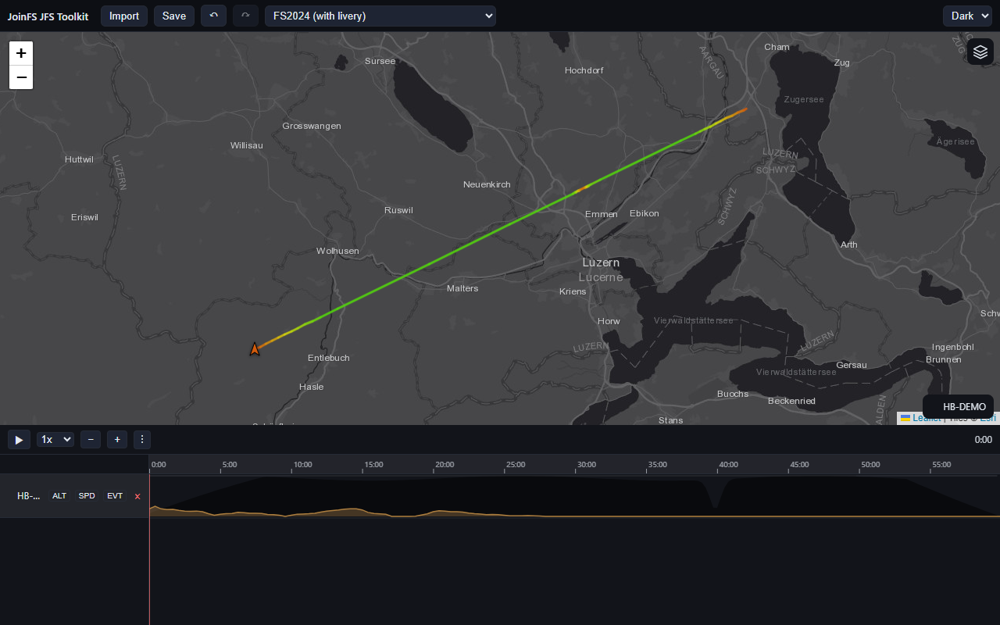
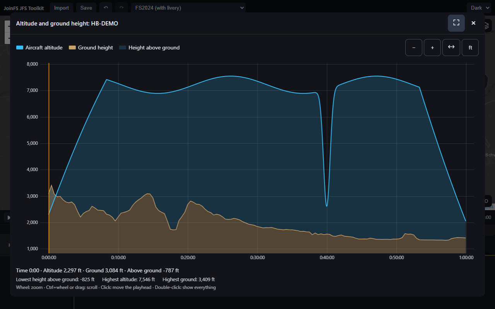

# Ground Height

How high did the aircraft really fly **above the ground**? The recording only holds the altitude above sea level, so the
toolkit can look the terrain height up along a track and show both together. It is a [plugin](Plugin-Concept)
(`ground-height`); everything else works without it.

Two entries in the track menu (right-click a track row, or the **⋮** button) belong to it:

## Show the terrain on the timeline

Choose **Ground height: show / hide**. The first time, the toolkit looks the terrain heights up (a notice says so, and
that the positions are sent to open-meteo.com); a moment later a brown profile appears in the track's **ALT** lane, on the
**same scale as the altitude**, so where the altitude area comes close to the brown profile the aircraft was close to the
ground.

- Choosing the entry again hides it; once more shows it again without asking the service a second time (the heights stay
  with the track until you close the page).
- If the **ALT** lane of that track is switched off, the terrain is on but cannot be seen, and a notice tells you.
- It is **undoable** (Ctrl+Z) and, like a pin, a working aid: it is **not saved** into the `.jfs`.

## The altitude and ground profile window

Choose **Altitude and ground profile…** for a large window with **one** aircraft: its altitude (blue), the terrain (brown)
and the height above ground between them. If the terrain was not looked up yet, it is done first.

| Do | With |
|---|---|
| zoom | mouse wheel (around the pointer), the **+** / **−** buttons, or the **+** / **−** keys |
| scroll | drag sideways, **Ctrl + wheel**, or the **←** / **→** keys |
| show the whole flight | the **↔** button, double-click, or **Home** |
| move the playhead | click in the diagram (it stays where you clicked after you close the window) |
| change feet / metres | the **ft** / **m** button |
| fill the whole screen | the button next to the **×** in the window's title bar |
| close | **×** or **Esc** |

Move the pointer over the diagram: the line below it shows the time, the altitude, the ground height and the **height above
ground** at that spot; the line under that shows the lowest height above ground of the whole flight, the highest altitude
and the highest ground. A negative height above ground means the recorded altitude is below the terrain model (a recording
of a flight on a different scenery, or an altitude offset) rather than a real crash.

On touch screens drag with one finger and pinch with two.

## Privacy and accuracy

- To look the terrain up, a thinned-out **sample of the positions** of the track (about one every 250 m, at most about 600,
  rounded to roughly 11 m) is sent to [open-meteo.com](https://open-meteo.com). Nothing else leaves your computer, and
  nothing is sent until you choose one of the two entries.
- It needs an **internet connection**. Offline, or when the service is busy, a notice says so and nothing changes.
- The terrain model has a **90 m grid**, so the heights are an estimate: good for terrain clearance, not for judging a
  runway. Open sea counts as 0 m; bridges, buildings and trees are not in the model.

See also [Known Limitations](Known-Limitations#ground-height). The chart and the lookup are the standalone component
[joinfs-ground-height-webcomponent](https://github.com/joeherwig/joinfs-ground-height-webcomponent), which ships inside the
plugin folder.
