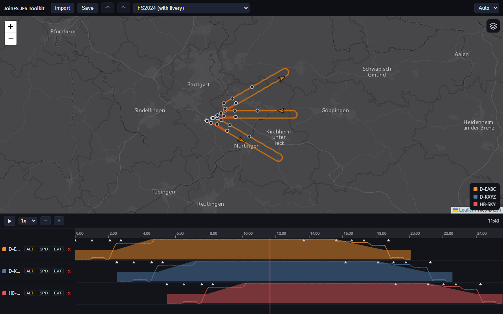

# JoinFS Recording Toolkit

A browser tool to **look at, tidy up and re-save JoinFS flight recordings** (`.jfs`). Every recorded aircraft is a
track on a map and on a video-editor-style timeline. You can line tracks up in time, cut the beginning and end off a
track, and save everything as one `.jfs` that JoinFS replays.

No installation and no build step: it is plain HTML and JavaScript. Your files never leave your computer.

> [!TIP]
> **Drag and drop:** drag one or **several** `.jfs` and `.gpx` files (even mixed) from your file manager onto the map
> or the timeline, and they are all imported at once. Each recorded aircraft becomes its own track.

## Where to start

| I want to... | Read |
|---|---|
| open a file, look around, save | [Getting Started](Getting-Started) |
| understand the map and the timeline | [Map and Timeline](Map-and-Timeline) |
| move, trim, pin or remove tracks, undo mistakes | [Editing Tracks](Editing-Tracks) |
| know what ends up in the saved file | [Saving and Formats](Saving-and-Formats) |
| use the keyboard and mouse faster | [Keyboard and Mouse](Keyboard-and-Mouse) |
| change the language or the theme | [Language and Theme](Language-and-Theme) |
| know what is not possible yet | [Known Limitations](Known-Limitations) |
| understand how features are built as plugins | [Plugin Concept](Plugin-Concept) |
| write my own plugin | [Writing a Plugin](Writing-a-Plugin) |

## Quick reference

| Keys | Action |
|---|---|
| **Ctrl+O** | import (open) files; or drop them onto the map or timeline |
| **Space** | play / pause |
| **+** / **−** | zoom the timeline in / out |
| **L** | cycle the map layer (dark, light, satellite) |
| **Ctrl+Z** / **Ctrl+Shift+Z** | undo / redo |
| **Ctrl+S** | save |
| **Esc** | close the open menu or dialog without applying; otherwise clear the selection |
| right-click a track row | track actions (pin, trim) |

All of them, with the mouse gestures, are on [Keyboard and Mouse](Keyboard-and-Mouse). On a Mac use Cmd instead of Ctrl.

## What it can do

- **Open** `.jfs` recordings (current JoinFS and older ones) and `.gpx` tracks (converted on the fly), several at once.
- **Show** every track's path on a map, coloured by altitude, grey while on the ground, with markers for gear, flaps
  and lights; and as altitude and speed charts on a timeline with a moving playhead.
- **Play back** all tracks together at 0.5x to 50x.
- **Edit:** shift a track in time, remove a track, pin a track so it cannot move, trim the start and end of a track.
  Everything is undoable.
- **Save** one `.jfs` in the layout current JoinFS reads.

The editing functions beyond the basics (pin, trim) are [plugins](Plugin-Concept): the viewer, playback and saving
work with every plugin switched off or missing.

## Related projects

- [joinfs-gpx-to-jfs-webcomponent](https://github.com/joeherwig/joinfs-gpx-to-jfs-webcomponent): the GPX converter
  used for `.gpx` import.
- [joinfs-map-websocket-webcomponent](https://github.com/joeherwig/joinfs-map-websocket-webcomponent): a live map for
  JoinFS.

## License

Creative Commons Attribution-NonCommercial-ShareAlike 4.0 International.
