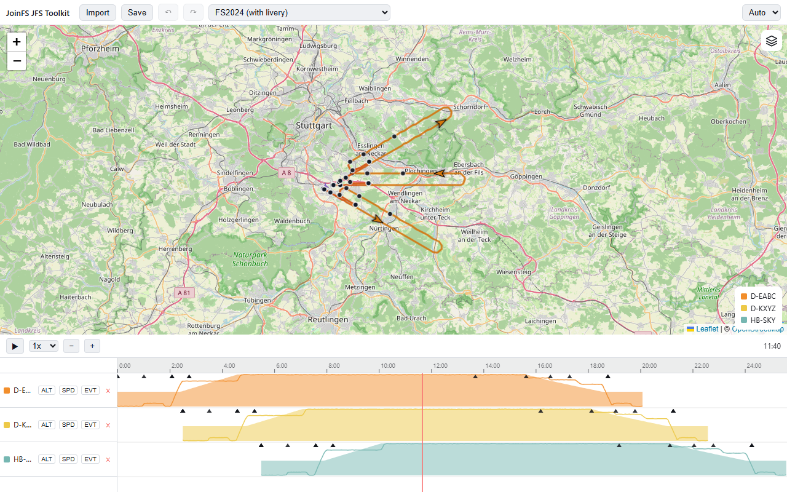
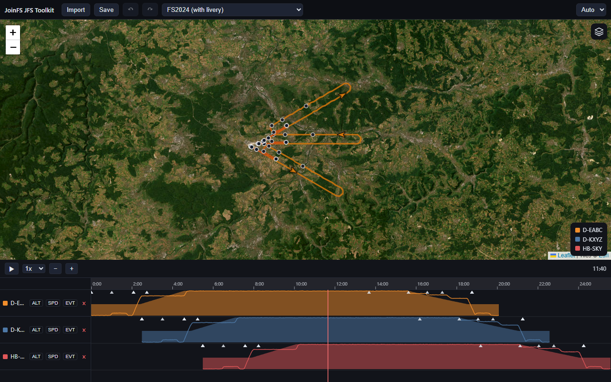

# Language and Theme

## Language

The toolkit speaks **English** (`en`) and **German** (`de`). Everything you can see or hear is translated: buttons,
tooltips, menus, dialogs, notices, and the strings of plugins and of the GPX converter dialog.

### How the language is chosen

1. The **`lang` parameter** in the address wins:

   | Address | Language |
   |---|---|
   | `http://localhost:5500/?lang=de` | German |
   | `http://localhost:5500/?lang=en` | English |

   Any other value is ignored and the next rule applies.
2. Otherwise the **browser's language list** is used, in order, and the first supported language wins. Regional tags
   count as their main language (`de-AT` and `de-CH` are German).
3. Otherwise **English**.

The language is read when the page loads. There is no switcher in the app: change the address (or the browser
language) and reload. The setting is not stored anywhere, so a bookmark with `?lang=de` is the way to keep German.

If a text is missing in a language, the English text is shown instead; a missing translation never breaks the app.

The same `lang` also drives the embedded GPX converter dialog and the strings that plugins bring with them
(`plugins/<id>/locales/<lang>.json`).

### Adding a language

1. Copy `src/locales/en.json` to `src/locales/<code>.json` and translate the values (keep the keys and the
   `{placeholders}`).
2. Do the same for every plugin (`plugins/<id>/locales/`) and for the converter's files in `src/vendor/`.
3. Add the code to the list of known languages in `src/i18n.js`.

## Theme

There are two independent choices: the **app theme** (toolbar, timeline, dialogs) and the **map layer**.

### App theme

The selector at the right of the toolbar offers:

| Choice | Result |
|---|---|
| **Auto** (default) | follows the system: dark when your operating system or browser prefers a dark colour scheme (`prefers-color-scheme: dark`), light otherwise; switches live when the system setting changes |
| **Light** | always light |
| **Dark** | always dark |

The choice is remembered in the browser (local storage, key `jfs-toolkit:appTheme`). It sets `data-theme="light"` or
`data-theme="dark"` on the `<html>` element. Canvas drawing in the timeline (time ruler, event markers, lines) follows
the theme, too.

**Light** (system prefers light, map layer *Light (OSM)*):

**Dark** (system prefers dark, map layer *Dark*):

### Map layer

The map has its own button (top right of the map) and the **L** key. They cycle through:

| Layer | Look |
|---|---|
| **Dark** (the start layer) | dark grey basemap, good contrast for coloured paths |
| **Light (OSM)** | OpenStreetMap |
| **Satellite** | satellite imagery |

The layer does **not** follow the app theme and is not remembered: the map starts with *Dark* on every load. The
grey on-ground part of the path is tuned for each layer so it stays readable.

**Satellite** (shown with the dark app theme):

### Restyling

The page colours are CSS custom properties on `:root` in `index.html` (`--bg`, `--fg`, `--panel-bg`, `--toolbar-bg`,
`--btn-bg`, `--btn-bg-hover`, `--border`, `--muted`), redefined for `:root[data-theme="light"]`. Change them there to
match your site. Components and dialogs use these tokens, so they follow automatically (a few accents, such as the amber trim borders and
the blue primary button, are fixed colours that work on both themes).
